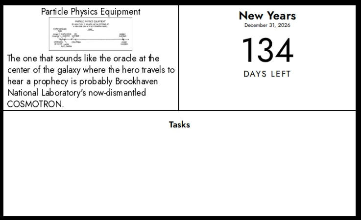
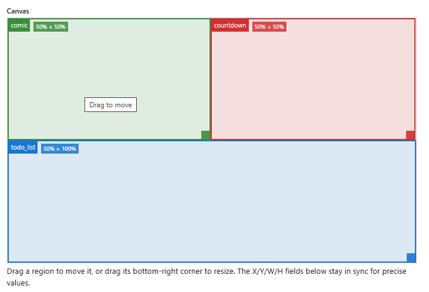

# InkyPi-Layout

Composes multiple existing InkyPi plugins into named rectangular regions on one screen, so a single display refresh can show, e.g., a comic strip + a countdown + your task list together.



## Compatibility

**Requires [jtn0123/InkyPi](https://github.com/jtn0123/InkyPi). This plugin does not work on upstream [fatihak/InkyPi](https://github.com/fatihak/InkyPi).** Composing other plugins' output requires calling into the host app's internal plugin registry (`plugins.plugin_registry.get_plugin_instance`) to instantiate and invoke them — a capability that exists only in this fork, not upstream. There is no compatibility path for running Layout on the upstream project.

## How it works

For each configured region, Layout looks up the target plugin by `plugin_id`, calls its own unmodified `generate_image()` — scoped to the region's exact pixel size so the child's own layout logic (font sizes, wrapping) adapts instead of getting cropped — and pastes the result onto the full canvas at `(x, y)`, with a 1px black border for legibility. Child plugins are called as black boxes; none of their code is touched.

## Features

- Any combination of installed plugins (built-in or third-party) can be assigned to any region
- Per-region optional `refresh_minutes` caches a region's rendered image so its plugin isn't invoked (and doesn't hit its upstream API) on every refresh — useful when one region needs fresher data than another
- If a region's plugin fails at render time (e.g. an upstream API outage), Layout falls back to that region's last successfully cached image rather than failing the whole screen
- A built-in "Home screen" preset pre-fills a concrete 4-region layout; the underlying mechanism supports arbitrary regions

## Installation

Install the plugin from this GitHub repository:

```bash
inkypi plugin install layout https://github.com/cartagena/InkyPi-Layout
```

This assumes a [jtn0123/InkyPi](https://github.com/jtn0123/InkyPi) checkout — see [Compatibility](#compatibility) above. If you're on a different fork, check that fork's own documentation, since plugin installation and loading steps can differ; upstream [fatihak/InkyPi](https://github.com/fatihak/InkyPi) isn't supported at all.

## Configuration

Regions are stored as a single JSON array (`regionsJson`). Each region:

```json
{
  "plugin_id": "blood_sugar",
  "x": 0, "y": 60, "w": 220, "h": 186,
  "settings": { "...": "same shape that plugin's own settings form would produce" },
  "refresh_minutes": 15
}
```



The settings page lets you add/remove regions and pick each region's plugin from a dropdown. Each region's `settings` are edited as that plugin's own real settings form — the same fields, labels, and show/hide behavior as the plugin's normal settings page, fetched and displayed inline per region — rather than hand-typed JSON. Two regions can target the same plugin independently; each gets its own copy of the form. A plugin whose settings include a rich picker (e.g. weather's map picker, calendar's calendar-URL list) gets everything else as real fields, with just that picker's own settings collapsed into a small "Advanced settings (JSON)" box scoped to those specific keys. A plugin with no settings form at all falls back to a single raw JSON textarea for the whole region, as before.

Each region also has a **"Start from existing instance"** dropdown, listing that plugin's instances already configured anywhere (any playlist, any other region) — picking one copies that instance's settings into the region as a starting point, so a config you've already built once doesn't need retyping. It's a one-time copy, not a live link: the region stays independently editable afterward, and later edits to either side don't affect the other. Generic style settings (frame, margins, background, text color) aren't copied — those apply to a full-screen rendering and aren't part of what a region's own settings form manages. Each region also gets a labeled, colored box on a visual canvas — sized to your device's real, orientation-adjusted resolution when the settings page has that context available, falling back to 800×480 otherwise — that you can drag to move and drag by its bottom-right corner to resize; the `x`/`y`/`w`/`h` number inputs stay next to it, in sync in both directions, for precise or keyboard-only editing. Regions must not exceed the canvas — this is validated both client-side and, authoritatively, against the actual configured display resolution inside `generate_image()`.

| Setting | Description |
| --- | --- |
| **Regions** | The region editor described above; persisted as `regionsJson`. |

## Important: this doesn't reduce panel refresh cadence

The per-region `refresh_minutes` cache only reduces how often *child plugins* hit their own upstream APIs. It does **not** reduce how often the physical e-paper panel refreshes — that's controlled by this Layout instance's own playlist refresh interval, which you're responsible for setting appropriately (e.g. to your fastest region's needs).

Cached region renders are stored as PNG files under InkyPi's plugin image directory (`<plugin_image_dir>/layout/`), with each file's own modification time serving as its "cached at" timestamp. Files left behind by regions you've since moved, resized, reconfigured, or deleted are swept automatically once they're 14 days old.

## Testing

Two suites, split by what they need. **Child plugins are faked in the unit suite and restricted to network-free built-ins (`clock`, `year_progress`) in the integration suite** — running the tests never contacts a third-party API.

### Unit tests — run anywhere

No InkyPi, no network, no browser. From a bare clone:

```bash
pip install -r requirements-dev.txt
pytest tests/unit
```

Covers pixel-accurate region placement, region borders, every validation error, per-region `refresh_minutes` caching (fresh hit, expiry, no-`refresh_minutes`), stale-cache pruning, stale-cache fallback on a child failure, placeholder rendering, child-image auto-resize, and the settings template's plugin listing and preset output.

Layout composites with PIL directly rather than going through the host's renderer, so its entire suite runs standalone — `tests/conftest.py` only needs to stand in for `BasePlugin`, the settings-schema DSL, the plugin registry, and `resolve_path`.

### Integration tests — need a real InkyPi checkout

Runs against the real `BasePlugin`, the real plugin registry, and real installed child plugins actually rendering through headless Chromium into one composite.

```bash
git clone https://github.com/jtn0123/InkyPi ../InkyPi
ln -s "$PWD/layout" ../InkyPi/src/plugins/layout
INKYPI_PATH=../InkyPi pytest tests/integration
```

Without `INKYPI_PATH` these are skipped, not failed, so a plain `pytest` from a clean clone still exits green having run the unit suite.

CI runs both, plus the *unit* suite a second time with `INKYPI_PATH` set — the same tests unstubbed, so a stub that has drifted from InkyPi's real behavior surfaces as a failure instead of quietly still passing.

## External API

This plugin makes no API calls of its own — it only calls other installed plugins' `generate_image()`. Whatever external APIs those plugins depend on (their keys, limits, and docs) are unchanged and apply as usual; see each plugin's own README/docs.

## Development status

**Actively maintained.**
